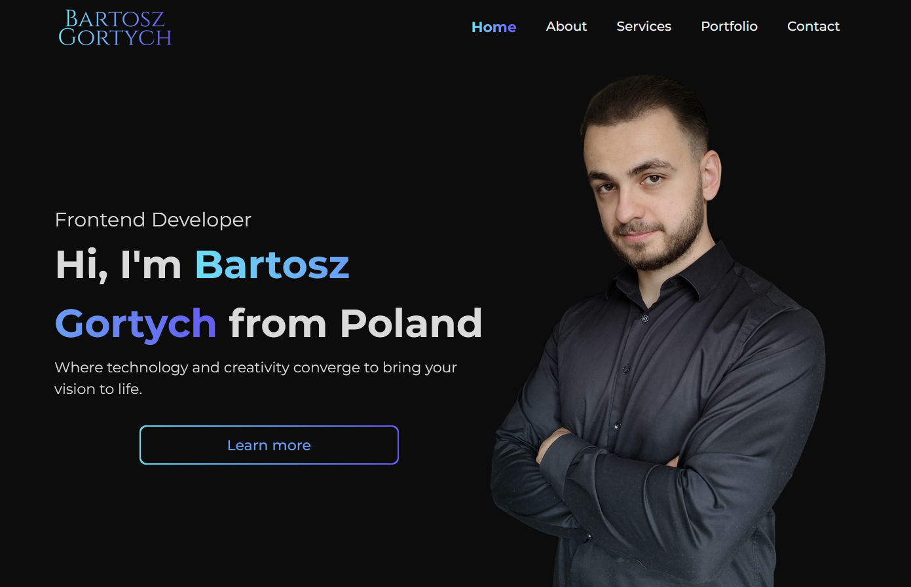
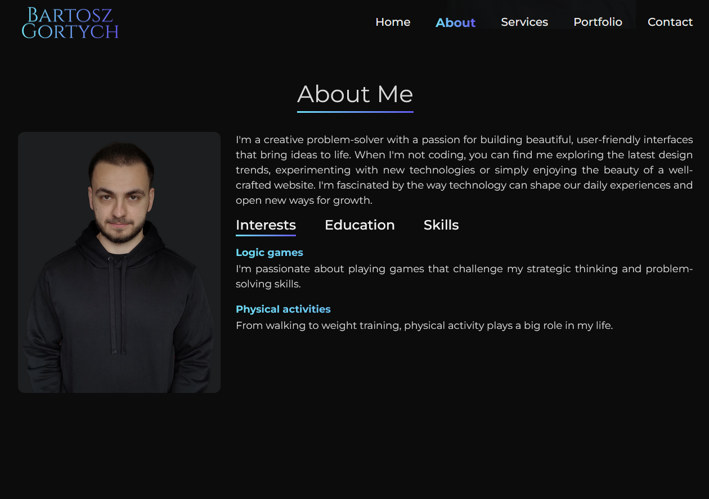
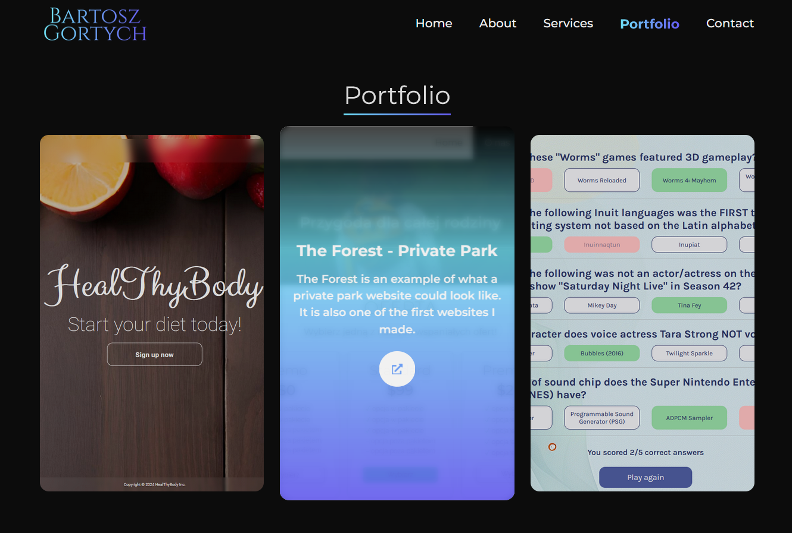

# My Portfolio Website

The website reflects my way of looking at web design. It was created using HTML, CSS/SASS, JavaScript, React. You can check out the live version [here](https://bartoszgortych.com/).

# Features

**Responsive design:** The website is optimized for all devices, including desktops, tablets, and mobile phones.

**Interactive portfolio:** Browse through my past projects and see the technologies and tools I used for each one.

**Contact form:** Get in touch with me directly through the website.

**Social media links:** Connect with me on LinkedIn, Facebook and Instagram.

# Images

# Contact

Feel free to contact me through the contact form on the website or through my social media links. I am always open to new opportunities and collaborations.

**Thank you for visiting my portfolio website! I hope you find it informative and inspiring.**
